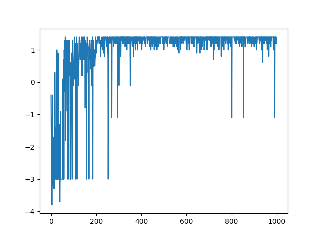
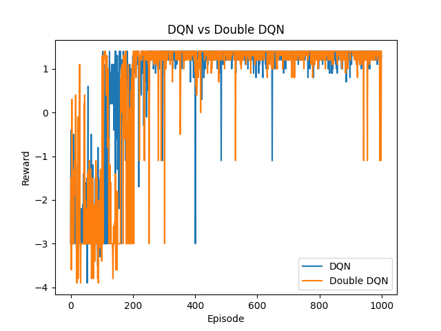
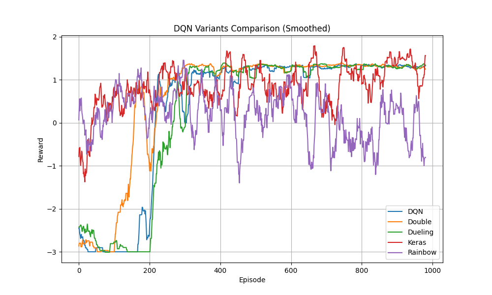

# Introduction

In this project, we explore the implementation and performance of various Deep Q-Network (DQN) architectures in a custom **GridWorld** environment. The agent's goal is to navigate toward a target while avoiding pits and minimizing unnecessary movement.

This homework progressively investigates:
- Basic DQN
- Experience Replay Buffer
- Double DQN
- Dueling DQN
- Rainbow DQN
- Randomized environments
- Training stabilization techniques
- Interactive visualization website

---

# Environment Settings

## GridWorld Environment

The GridWorld environment is a 4×4 grid where the agent learns optimal navigation policies.

### Reward Settings

| Event | Reward |
| :--- | :--- |
| Reach Goal | +2.0 |
| Fall into Pit | -1.0 |
| Each Step | -0.1 |

### Environment Modes

| Mode | Description |
| :--- | :--- |
| `static` | Fixed positions for all objects |
| `player` | Random player start position |
| `random` | Fully randomized environment |

---

# DQN Architecture

The implemented DQN model uses a simple fully connected neural network:

```text
Input State (4)
      ↓
Linear Layer (128)
      ↓
    ReLU
      ↓
Output Q-values (4 actions)
```

**Input state representation:**
$s = [player_x, player_y, goal_x, goal_y]$

**The network predicts Q-values for:**
- Up
- Down
- Left
- Right

---

# HW3-1: Naive DQN for Static Mode

### Basic DQN Implementation
Deep Q-Network (DQN) combines traditional Q-learning with deep neural networks. Instead of storing a Q-table for every state-action pair, the neural network approximates the Q-value function:
$$Q(s, a; \theta) \approx Q^*(s, a)$$
The model receives the current state as input and predicts Q-values for all possible actions.

### Bellman Equation
The target Q-value is computed using:
$$Y = R + \gamma \max_{a'} Q(s', a'; \theta^-)$$
where:
- $\gamma$ is the discount factor
- $\theta^-$ represents the target network parameters

### Loss Function
Mean Squared Error (MSE) was used:
$$L = (Q(s, a) - Y)^2$$

### Experience Replay Buffer
To stabilize training, an Experience Replay Buffer was implemented. In standard Reinforcement Learning, consecutive transitions $(S, A, R, S')$ are highly correlated. Training directly on correlated data can destabilize neural network learning and cause overfitting to recent trajectories.

The Experience Replay Buffer stores past transitions and randomly samples mini-batches during training.

**Benefits:**
- Breaks temporal correlation
- Improves sample efficiency
- Stabilizes training
- Allows repeated learning from past experiences

### Baseline Performance

*Figure 1: Reward curve for Basic DQN in Static Mode.*

---

# HW3-2: Enhanced DQN Variants for Player Mode

Although Basic DQN performs well, it suffers from several limitations including:
- Q-value overestimation
- Inefficient state representation learning

To address these issues, Double DQN and Dueling DQN were implemented.

## Double DQN

### Problem in Basic DQN
Basic DQN uses the same network for selecting the best action and evaluating the selected action. This causes systematic overestimation bias.

### Double DQN Solution
Double DQN separates action selection from evaluation:
$$Y_t^{DoubleDQN} = R_{t+1} + \gamma Q(S_{t+1}, \arg\max_a Q(S_{t+1}, a; \theta_t); \theta^-_t)$$

**Advantages:**
- Reduces overestimation
- Produces smoother reward curves
- Improves training stability

## Dueling DQN

### Problem in Basic DQN
In many states, the exact action choice has minimal effect on the final outcome. Standard DQN still estimates individual Q-values for every action.

### Dueling Architecture
Dueling DQN separates learning into:
- **State Value Stream**: $V(s)$
- **Advantage Stream**: $A(s, a)$

The final Q-value is computed using:
$$Q(s, a) = V(s) + \left( A(s, a) - \frac{1}{|A|} \sum_{a'} A(s, a') \right)$$

**Advantages:**
- Faster convergence
- Better state representation
- Improved learning efficiency

### Comparison Results

*Figure 2: Performance comparison between Basic DQN and Double DQN.*

---

# HW3-3: Enhanced DQN for Random Mode

## Random Mode Environment
To increase environment complexity, Random Mode was introduced.

**Features:**
- Random player positions
- Random goal positions
- Random pit positions

This prevents the agent from memorizing fixed trajectories and forces policy generalization. The random mode introduces significant stochasticity, so stronger exploration and more stable value estimation become crucial.

## Keras Implementation
The original PyTorch implementation was converted into Keras using TensorFlow.

**Keras Model:**
```python
model = Sequential([
    Dense(128, activation='relu'),
    Dense(4)
])
```
The Keras implementation successfully reproduced the learning behavior of the PyTorch version.

## Training Stability & Optimization
Several stabilization techniques were integrated to improve convergence in the random environment.

### Target Network Updates
A separate target network was periodically synchronized with the online network.
- **Benefits**: Stabilizes Q-value estimation, prevents oscillation.

### Epsilon Decay
The exploration probability gradually decreases: $\epsilon = \max(\epsilon_{min}, \epsilon \times decay)$.
- **Benefits**: Encourages exploration during early training, enables exploitation during later training.

### Gradient Clipping
Large gradients were clipped to avoid unstable updates.
- **Benefits**: Prevents exploding gradients, improves training stability.

### Learning Rate Scheduling
The learning rate was dynamically reduced during training.
- **Benefits**: Faster early learning, more precise late-stage convergence.

---

# HW3-4: Full Rainbow DQN Integration

To solve the challenging random environment, a Full Rainbow DQN implementation was developed. Rainbow DQN integrates multiple DQN improvements into a unified framework.

### Rainbow DQN Components
The Rainbow implementation combines:
- Double DQN
- Dueling Network Architecture
- Prioritized Experience Replay (PER)
- Noisy Networks
- Distributional RL (C51)
- Multi-step Learning

### Why Rainbow DQN Works Better
Each Rainbow component improves a different weakness of standard DQN:

| Component | Improvement |
| :--- | :--- |
| Double DQN | Reduces overestimation |
| Dueling DQN | Better state representation |
| PER | Learns more from important experiences |
| Noisy Networks | Better exploration |
| Distributional RL | Models uncertainty |
| Multi-step Learning | Faster reward propagation |

---

# Experimental Results

### Full Model Comparison

*Figure 3: Smoothed reward curves comparing all implemented models.*

### Experimental Analysis
From the reward curves, several observations can be made:
1. **Basic DQN** learns successfully in static environments but struggles in highly stochastic random environments.
2. **Double DQN** reduces reward oscillation caused by Q-value overestimation.
3. **Dueling DQN** converges faster by separating state-value and advantage estimation.
4. **Rainbow DQN** demonstrates the best overall performance due to the integration of multiple complementary improvements.

However, Rainbow DQN occasionally shows unstable reward spikes because aggressive exploration methods such as noisy networks increase variance during training.

### Heatmap Visualization
Q-value heatmaps were generated using trained models. The heatmaps visualize:
- State importance
- Learned policies
- Action preferences

These visualizations help explain how the agent interprets the environment after training.

---

# Interactive Visualization Website

A Streamlit-based interactive visualization website was developed.

**Website Features:**
- Real-time GridWorld simulation
- Model switching (DQN / Double / Dueling / Rainbow)
- Q-value heatmaps
- Policy visualization
- Agent trajectory animation
- Static and Random mode support

The website provides intuitive visualization of reinforcement learning behaviors and learned policies.

---

# Conclusion

In this homework, several Deep Q-Network variants were implemented and evaluated in GridWorld environments. The experiments demonstrated that:
- Experience Replay significantly improves training stability.
- Double DQN reduces overestimation bias.
- Dueling DQN improves representation learning efficiency.
- Rainbow DQN achieves the best overall performance.

Experimental results show that Rainbow DQN achieved the fastest convergence and highest average reward among all tested methods. Additionally, the project explored Keras framework conversion, training stabilization techniques, and interactive visualization systems.

Overall, the project demonstrates how combining multiple reinforcement learning improvements can substantially enhance performance in stochastic environments.

---

# References
1. DeepMind. Human-level control through deep reinforcement learning.
2. Deep Reinforcement Learning in Action.
3. PyTorch Documentation.
4. TensorFlow / Keras Documentation.
5. Rainbow: Combining Improvements in Deep Reinforcement Learning.
